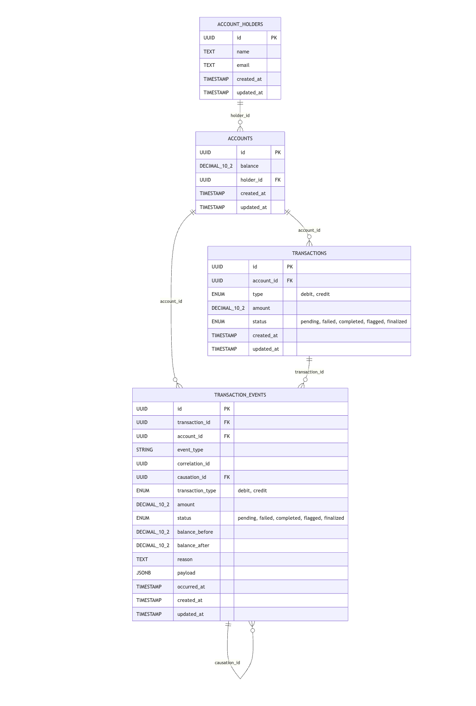
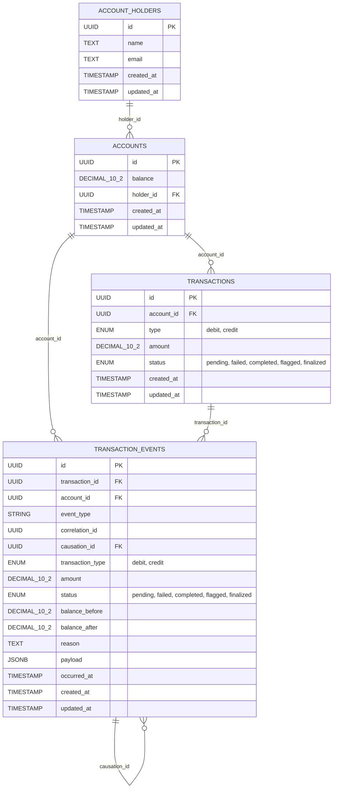

# Banking System

A TypeScript banking transaction service built around PostgreSQL, Sequelize, Express, and Kafka. The system accepts transaction requests asynchronously, runs fraud checks, applies ledger updates, emits status events, and persists audit events for replay and regulator traceability.

## Menu

- [Tech Stack](#tech-stack)
- [Local Setup](#local-setup)
- [API Contract](#api-contract)
- [Kafka Configuration](#kafka-configuration)
- [ER Diagram](#er-diagram)
- [Tests](#tests)

## Tech Stack

- Node.js + TypeScript
- Express 5
- PostgreSQL
- Sequelize + Sequelize CLI migrations
- Kafka via `kafkajs`
- `decimal.js` for money arithmetic
- Node built-in test runner

## Local Setup

Install dependencies:

```bash
npm install
```

Create a `.env` file with values matching your local Postgres and Kafka setup:

```env
PORT=3000
DB_HOST=127.0.0.1
DB_PORT=5432
DB_NAME=bank_db
DB_USERNAME=admin
DB_PASSWORD=admin
KAFKA_BROKER1=127.0.0.1:9092
KAFKA_MAX_RETRIES=3
KAFKA_RETRY_BASE_MS=1000
```

Run migrations:

```bash
npx sequelize-cli db:migrate
```

Start the service:

```bash
npm run dev
```

Run tests:

```bash
npm test
```

## API Contract

Base path:

```text
/api/v1
```

### Create Account

```http
POST /api/v1/account-holders
Content-Type: application/json
```

Request:

```json
{
  "name": "Asha Rao",
  "email": "asha@example.com"
}
```

Response:

```json
{
  "success": true,
  "message": "Account created successfully."
}
```

This creates one `account_holders` row and one linked `accounts` row with an initial balance of `0`.

### Create Transaction

```http
POST /api/v1/transactions
Content-Type: application/json
```

Request:

```json
{
  "transactionId": "11111111-1111-1111-1111-111111111111",
  "accountId": "aaaaaaaa-aaaa-aaaa-aaaa-aaaaaaaaaaaa",
  "type": "debit",
  "amount": "12000.00",
  "deviceFingerprint": "device-123"
}
```

Allowed `type` values:

```text
debit, credit
```

Response:

```json
{
  "success": true,
  "correlationId": "11111111-1111-1111-1111-111111111111",
  "causationId": "event-id",
  "transactionId": "11111111-1111-1111-1111-111111111111",
  "status": "pending",
  "clientStatus": "pending",
  "message": "Transaction pending",
  "updatedAt": "2026-05-06T00:00:00.000Z"
}
```

Duplicate `transactionId` responses:

```http
409 Conflict
```

### Transaction Status Stream

```http
GET /api/v1/transactions/:transactionId/events
```

Server-sent event name:

```text
transaction.status
```

Event payload:

```json
{
  "transactionId": "11111111-1111-1111-1111-111111111111",
  "status": "completed",
  "clientStatus": "completed",
  "message": "Transaction completed",
  "updatedAt": "2026-05-06T00:00:00.000Z"
}
```

Terminal statuses close the stream:

```text
completed, failed, flagged, finalized
```

### Replay Account Balance

```http
GET /api/v1/audit/accounts/:accountId/replay
```

Optional query params:

```text
from=2026-01-01T00:00:00.000Z
to=2026-01-31T23:59:59.999Z
date=2026-01-04
type=debit
amount=12000.00
```

Response:

```json
{
  "success": true,
  "accountId": "aaaaaaaa-aaaa-aaaa-aaaa-aaaaaaaaaaaa",
  "rebuiltBalance": "8000.00",
  "storedBalance": "8000.00",
  "matchesStoredBalance": true,
  "eventsReplayed": 2,
  "events": []
}
```

Replay uses only `transaction.completed` events with `status = completed`. Failed and blocked transactions are kept in the audit trail but ignored for balance math.

### Account Audit Events

```http
GET /api/v1/audit/accounts/:accountId/events
```

Useful regulator query:

```http
GET /api/v1/audit/accounts/:accountId/events?type=debit&amount=12000.00&date=2026-01-04
```

Response:

```json
{
  "success": true,
  "accountId": "aaaaaaaa-aaaa-aaaa-aaaa-aaaaaaaaaaaa",
  "events": [
    {
      "id": "event-id",
      "transactionId": "11111111-1111-1111-1111-111111111111",
      "accountId": "aaaaaaaa-aaaa-aaaa-aaaa-aaaaaaaaaaaa",
      "eventType": "transaction.completed",
      "correlationId": "11111111-1111-1111-1111-111111111111",
      "causationId": "previous-event-id",
      "transactionType": "debit",
      "amount": "12000.00",
      "status": "completed",
      "balanceBefore": "20000.00",
      "balanceAfter": "8000.00",
      "reason": null,
      "payload": {},
      "occurredAt": "2026-01-04T10:00:00.000Z"
    }
  ]
}
```

### Correlation Trace

```http
GET /api/v1/audit/correlations/:correlationId
```

In the current system, `correlationId` is the same as `transactionId`. The trace shows the full event path:

```text
transaction.requested -> transaction.approved -> transaction.completed
```

or:

```text
transaction.requested -> transaction.blocked
```

Response:

```json
{
  "success": true,
  "correlationId": "11111111-1111-1111-1111-111111111111",
  "events": []
}
```

## Kafka Configuration

Required broker env:

```env
KAFKA_BROKER1=127.0.0.1:9092
```

Retry env:

```env
KAFKA_MAX_RETRIES=3
KAFKA_RETRY_BASE_MS=1000
```

Kafka client ID:

```text
transactions-processing-system
```

Topics:

```text
transaction.requested
transaction.approved
transaction.blocked
transaction.completed
transaction.failed
```

Consumer groups:

```text
fraud-analysis-service    consumes transaction.requested
ledger-service            consumes transaction.approved
analytics-service         consumes transaction.completed
notification-service      consumes transaction.completed
```

Message values are wrapped before publishing:

```json
{
  "payload": "{\"transactionId\":\"...\"}",
  "metadata": {
    "attempt": 0,
    "sourceTopic": "transaction.requested"
  }
}
```

On handler failure:

1. The wrapper reads `metadata.attempt`.
2. If retries remain, it waits with exponential backoff.
3. It republishes the same payload to the same topic with `attempt + 1`.
4. It commits the failed message offset after creating the retry message.
5. If retries are exhausted, it publishes to `<topic>.dlq`.

DLQ payload:

```json
{
  "originalTopic": "transaction.approved",
  "payload": "{\"transactionId\":\"...\"}",
  "metadata": {
    "attempt": 3,
    "sourceTopic": "transaction.approved",
    "lastError": "database unavailable",
    "failedAt": "2026-05-06T00:00:00.000Z",
    "consumerGroup": "ledger-service"
  }
}
```

Reprocess a DLQ topic:

```bash
npm run reprocess:dlq -- transaction.approved.dlq
```

## Event Replay And Audit

Every important transaction step is stored in `transaction_events`.

Event path:

```text
transaction.requested
  -> transaction.approved
  -> transaction.completed
```

Fraud block path:

```text
transaction.requested
  -> transaction.blocked
```

Failure path:

```text
transaction.requested
  -> transaction.approved
  -> transaction.failed
```

Audit identifiers:

- `correlation_id`: groups the full transaction journey. Currently equal to `transaction_id`.
- `causation_id`: points to the previous event that caused this event.

Ledger events record:

- `balance_before`
- `balance_after`
- `amount`
- `transaction_type`
- `status`
- `reason`

This supports regulator questions such as:

```text
Why was 12000 debited from account X on Jan 4?
```

Use:

```http
GET /api/v1/audit/accounts/:accountId/events?type=debit&amount=12000.00&date=2026-01-04
GET /api/v1/audit/correlations/:correlationId
GET /api/v1/audit/accounts/:accountId/replay
```

## ER Diagram



This diagram includes the strict intended relationships. The first two foreign keys are currently enforced by migration. The `transaction_events` relationships are audit links and should be treated as intended foreign-key relationships for the stricter model.



Strict relationship list:

```text
account_holders.id    -> accounts.holder_id
accounts.id           -> transactions.account_id
accounts.id           -> transaction_events.account_id
transactions.id       -> transaction_events.transaction_id
transaction_events.id -> transaction_events.causation_id
```

## Tests

Tests live in:

```text
src/__tests__
```

Covered behavior:

- Duplicate transaction request
- Concurrent debit requests
- Worker crash during processing
- Retry and DLQ behavior
- Fraud block correctness
- Event replay rebuilding balances

Run:

```bash
npm test
```
